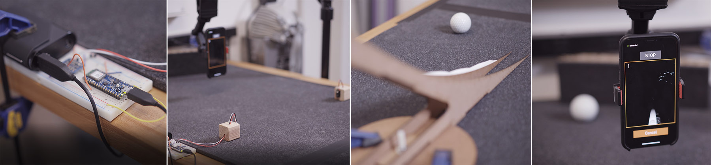
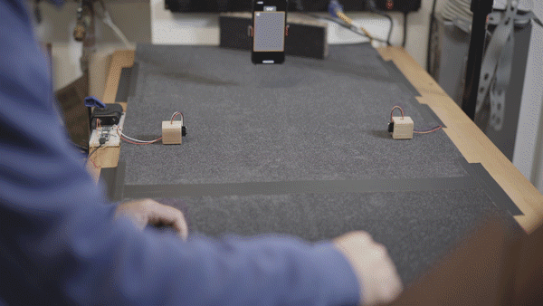

# Image capture tool for machine learning
## Automate the production of training images

So. We need a classifier. The goal is to train an image classifier to detect when a golf ball is rolling towards an iPhone. Why do we want to do this? Well, we are building an app for golfers that allows players to practice putting. The idea is to turn the iPhone into a “hole.” Using a special holder, called a Qlippy, players will putt the ball to the phone. Hitting the phone is akin to making the putt. Missing the phone is, well, missing the putt. Our job here is to detect when a putt is attempted. This way we can provide feedback on misses. If we simply relied on the ball hitting the phone to record putts made, misses would go untracked. Not great for a putting game. The screen can be used as an interface to give feedback to the player, enabling a kind of game-like experience. Making putting practice fun, and hopefully productive.

An image classifier is only as good as the body of images used to train it. So, we need hundreds and hundreds of images, maybe even thousands to train our model. We’ve decided to use a motion history image to more easily identify a rolling ball. We could just detect the ball itself, but how would we differentiate between a ball at rest, and a ball rolling. It’s the motion that we want to classify.

How do we capture hundreds of images that are unique and diverse? And, how do make this as easy as possible?

What we have here is a special rig: an iPhone mounted above the rolling path of the ball, a set of infrared gates to trigger an image capture, and a ramp to roll balls at various speeds and directions. All we have to do is mindlessly roll balls. Well, we do need a variety of speeds and directions, but automatically capturing the images with our IR trigger and iPhone setup will make generating a large quatity of images much easier. Basically, I am lazy. Real lazy. And this tool will help automate the image generation process. Which should, in theory, make the image classifier we generate more robust and effective.

## Tech

- [iOS] - Native iOS app written in ObjC
- [Arduino] - Arduino Micro BLE used to control IR gates
- [CoreML] - Image sets trained and validated with CoreML